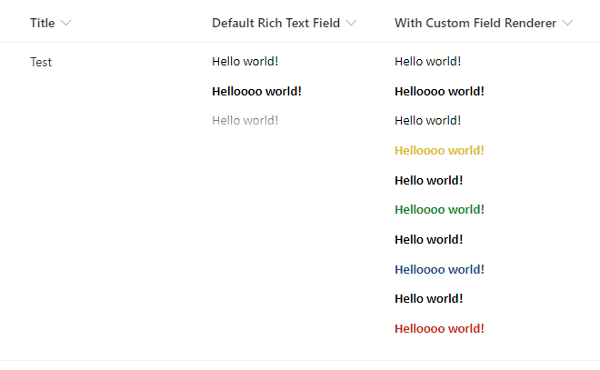

# Rich Text Field Renderer

## Summary

A simple rich text field renderer to display the full contents of a rich text HTML field. Normally a rich text field will get truncated in a list or library view if the contents consume too much vertical space. This SPFx field customizer will display the entire contents of the field without vertical truncation. See screenshot below from a modern list view for comparison.



## Used SharePoint Framework Version


## Setup Instructions
### Pre-requisites
- App Catalog: Ensure the [App Catalog](https://docs.microsoft.com/en-us/sharepoint/use-app-catalog) is setup in your SharePoint Online tenant
- PnP PowerShell: Ensure you have the latest version of the [SharePointPnPPowerShellOnline](https://docs.microsoft.com/en-us/powershell/sharepoint/sharepoint-pnp/sharepoint-pnp-cmdlets?view=sharepoint-ps) module installed.

### Installation
1. Download the SPFx package [rich-text-field-renderer.sppkg](./sharepoint/solution/rich-text-field-renderer.sppkg) file from Github (or clone the repo and build the package yourself)
2. Upload sppkg file to the 'Apps for SharePoint' library in your Tenant App Catalog
3. Click the 'Make this solution available to all sites in your organization' checkbox and then click Deploy
4. Connect to the target site(s), then configure each list or site field that requires the Custom Rich Text Renderer using steps below.
   #### PnP PowerShell
   ```powershell
   Connect-PnPOnline -Url "https://tenant.sharepoint.com/sites/target"
   
   # Connect the custom field renderer to a target field
   # Run the following command for each field that requires the renderer
   Set-PnPField -List "<<List Title>>" -Identity "<<Field Internal Name>>" -Values @{ ClientSideComponentId = [Guid]::new("2a3318bf-6c55-4c14-acee-b5da9c314cc2") }
   ```

### Updates
Follow the same steps as installation. Overwrite the existing package in the 'Apps for SharePoint' library when uploading the new package. 

> __Tip__: Be sure to check-in the sppkg file after the deployment if it is left checked-out.

## Removal

### Uninstall from a Site or Web
1. Unregister the SPFx extension on your target SharePoint site(s) using one of the methods below.
   #### PnP PowerShell
   ```powershell
   Connect-PnPOnline -Url "https://tenant.sharepoint.com/sites/target"
   
   # Disconnect the custom field renderer from a target field
   # Run the following command for each field that should no longer use the renderer 
   Set-PnPField -List "<<List Title>>" -Identity "<<Field Internal Name>>" -Values @{ ClientSideComponentId = $null }
   ```

### Uninstall from Tenant
1. Follow steps to uninstall the SPFx extension from all sites.
2. Delete the `rich-text-field-renderer.sppkg` file from the 'Apps for SharePoint' library in your Tenant App Catalog.

## Version history

Version|Date|Comments
-------|----|--------
1.0|September 14, 2020|Initial release

## Disclaimer

Microsoft provides programming examples for illustration only, without warranty either expressed or implied, including, but not limited to, the implied warranties of merchantability and/or fitness for a particular purpose. We grant You a nonexclusive, royalty-free right to use and modify the Sample Code and to reproduce and distribute the object code form of the Sample Code, provided that You agree: (i) to not use Our name, logo, or trademarks to market Your software product in which the Sample Code is embedded; (ii) to include a valid copyright notice on Your software product in which the Sample Code is embedded; and (iii) to indemnify, hold harmless, and defend Us and Our suppliers from and against any claims or lawsuits, including attorneys' fees, that arise or result from the use or distribution of the Sample Code.

## References

- [Getting started with SharePoint Framework](https://docs.microsoft.com/en-us/sharepoint/dev/spfx/set-up-your-developer-tenant)
- [Building for Microsoft teams](https://docs.microsoft.com/en-us/sharepoint/dev/spfx/build-for-teams-overview)
- [Use Microsoft Graph in your solution](https://docs.microsoft.com/en-us/sharepoint/dev/spfx/web-parts/get-started/using-microsoft-graph-apis)
- [Publish SharePoint Framework applications to the Marketplace](https://docs.microsoft.com/en-us/sharepoint/dev/spfx/publish-to-marketplace-overview)
- [Microsoft 365 Patterns and Practices](https://aka.ms/m365pnp) - Guidance, tooling, samples and open-source controls for your Microsoft 365 development
